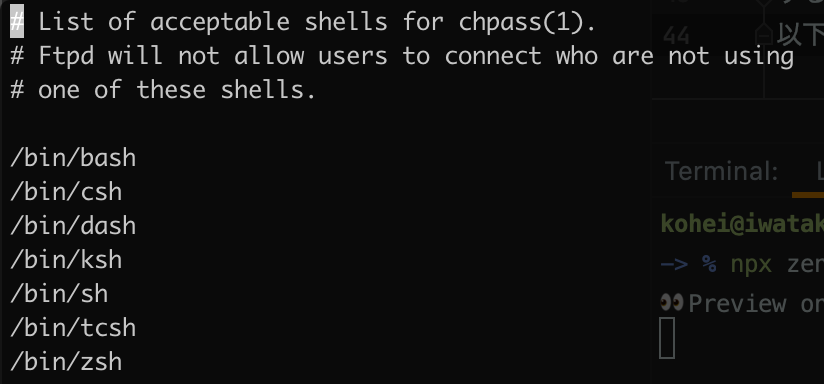

お恥ずかしい話、プログラマーの身でありながら、シェルにこだわりを持っていませんでした。

npm や node.js, その他のコマンドを打つ上で視認性、実用性を見直す様になり、zsh シェルのカスタムを行いました。  
その一連の流れを備忘録として記事にしていきます。

ここでは、zsh のセットアップから、テーマ、コマンドの色付け、alias について執筆します。

## 使用シェルを確認する

まず自身のログインシェルを確認しましょう。  
ログインして最初に動き出すシェルのことです。

```
echo $SHELL

// 使用シェルのパスが出てくる
/usr/local/bin/zsh
```

zsh が使用されていればそのまま使用します。  
もし、bash など他のシェルを使用しているならば zsh に変更する必要があります。

## 使用シェルを zsh へ変更する

zsh をインストールします。  
ここでは Homebrew を利用しています。

```
brew install zsh
```

使用できるシェルを確認しましょう。

```
sudo vi /etc/shells
Password:
```

すると使用できるシェルのパスがずらっと出てきます。  
以下の様な見た目です。



確認後はインストールした zsh までのパスを追記します。

```
// 最後の行に書き込む
/usr/local/bin/zsh
```

ログインシェルを変更しましょう。

```
chsh -s /usr/local/bin/zsh
```

変更が終わりましたら、確認をしましょう。  
確認のために、一回ターミナルを終了して再度開きましょう。

```
echo $SHELL

/usr/local/bin/zsh
```

以上で zsh がログインシェルになりました。

## oh-my-zsh を導入

zsh のフレームワークになります。様々なプラグインが入っています。  
テーマであったり、alias など、設定が可能になっています。

```
sh -c "$(curl -fsSL https://raw.githubusercontent.com/robbyrussell/oh-my-zsh/master/tools/install.sh)"
```

すると、ホームディレクトリに.zshrc ファイル（設定ファイル）が作成されます。  
このファイルをカスタマイズしていくことになります。

## .zshrc の設定

### プロンプト変更

テーマを変更してみましょう。

```
vi ~/.zshrc
```

ずらっと設定内容が出てきますが、その中で`ZSH_THEME="robbyrussell"`が設定されているので、別テーマに変えてみましょう。

```
// 10行目にあります。
// ここではclearというテーマを設定しています。
ZSH_THEME="clear"
```

変更後は`source ~/.zshrc`を実行しないと変更が反映されませんので、忘れず行ってください。

その他のテーマは以下の GitHub Wiki を参照ください。
[oh-my-zsh theme](https://github.com/ohmyzsh/ohmyzsh/wiki/Themes)

### コマンドの色付け

`npx`であったり、`cd`といったコマンドに色をつけるための設定です。  
zsh-syntax-highlighting を git clone します。

```
git clone https://github.com/zsh-users/zsh-syntax-highlighting.git ${ZSH_CUSTOM:-~/.oh-my-zsh/custom}/plugins/zsh-syntax-highlighting
```

clone できましたら、先ほどと同じ様に`vi ~/.zshrc`を行い、設定を変更します。

```
// 54行目のpluginsを変更
plugins=(git zsh-syntax-highlighting)
```

これで、コマンドの色付けは完了しました。

### alias

oh-my-zsh にはデフォルトで alias がたくさん入っています。  
なにが設定されているかは、`alias`と打つと確認できます。

追加でカスタムエイリアスを設定したい際には、`.zshrc`ファイルに`alias ...`と追記します。

```
// 例
alias yad='yarn add --dev'
```

## 注意点

- oh-my-zsh は比較的重いです。動作はデフォルトよりも重くなりますので、気になる人は使用を控えた方がいいかもです。
- テーマ変更の際に注意書きしましたが、変更を反映したい際は`source ~/.zshrc`で登録しましょう。

## 変更後の感想

見た目が変わったことで、視認性がよく使いやすくなりました。  
やはり見た目が変わると、コマンドを打つのが楽しくなってきますね。

「黒い画面、苦手...」と思っている方は、少しでも見た目から自分好みのものにしていくと愛着が湧いてくるかもしれません（技術的には頑張っていかないといけませんが...）。
