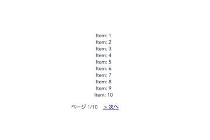

## 完成品


環境はViteを使用しています。

前へ、次へボタンを押すと10ページ区切りでアイテムが表示されます。  
また、最初最後は不要ボタンを非表示にするようにしています。

## コード
親コンポーネント App.vueと、子コンポーネント PrevNext.vueを作成します。

### App.vue

```js:title=App.vue
<template>
  <ol>
    <li
      v-for="(item, index) in filterData"
      :key="index"
    >
      {{ item }}
    </li>
  </ol>
  <prev-next
    :page="page"
    :total-page="totalPage"
    @change="onPageChange"
  />
</template>

<script>
import { defineComponent, toRefs, reactive, computed } from 'vue'

import PrevNext from "./components/PrevNext.vue";

export default defineComponent({
  name: 'App',
  components: {
    PrevNext
  },
  setup() {
    const items = new Array(100).fill(null).map((_, idx) => `Item: ${idx + 1}`)
    const perPage = 10
    const datas = reactive({
      items, // ダミーデータ
      page: 1, // 現在のページ
      perPage, // 1ページごとのデータ表示数
      totalPage: Math.ceil(items.length / perPage) // perPageに基づいたページ総数
    })

    const filterData = computed(() => datas.items.slice((datas.page - 1) * datas.perPage, datas.page * datas.perPage))
    const onPageChange = (page) => {
      datas.page = page
    }

    return {
      filterData,
      onPageChange,
      ...toRefs(datas)
    }
  }
})
</script>
```

__items__ には仮のダミーデータ100個が配列として入っている前提です。  
__filterData__ にはcomputedを使用し、ページに応じたデータを抽出するように処理しています。  
__onPageChange関数__ ですが、子コンポーネントからページネーションした後に変更したpageを受け取り、反映するようになっています。

ここで、reactive や toRefs といった新しい関数が出現しました。  
__reactive__ は設定した値を文字通りリアクティブにします。Vue.observableに相当するものでしょうか。  
__toRefs__ は、reactiveで定義したオブジェクトをそれぞれrefみたく定義した形にし、直接変更にしてもリアクティブを無くさないようにする？といったものらしいです。（これに関してはより深く知りたいので別記事にします）。

setup内でtemplate側で使用する変数、関数は必ずオブジェクトでreturnする必要があります。

### PrevNext.vue
```js:title=PrevNext.vue
<template>
  <div class="pagination">
    <a
      class="prev"
      :href="`?page=${prevPage}`"
      @click.prevent="onPrev"
      v-show="currentPage > 1"
    >
      &lt; 前へ
    </a>
    <div class="total">ページ {{ currentPage }}/{{ totalPage }}</div>
    <a
      class="next"
      :href="`?page=${nextPage}`"
      @click.prevent="onNext"
      v-show="currentPage < totalPage"
    >
      &gt; 次へ
    </a>
  </div>
</template>

<script>
import { defineComponent, ref, computed } from 'vue'
export default defineComponent ({
  props: {
    page: {
      default: 0,
      type: Number
    },
    totalPage: {
      default: 0,
      type: Number
    }
  },
  setup(props, ctx) {
    const currentPage = ref(props.page)
    const prevPage = computed(() => Math.max(currentPage.value - 1, 1))
    const nextPage = computed(() => Math.min(currentPage.value + 1, props.totalPage))

    const onPrev = () => {
      currentPage.value = Math.max(currentPage.value - 1, 1)
      ctx.emit('change', currentPage)
    }
    const onNext = () => {
      currentPage.value = Math.min(currentPage.value + 1, props.totalPage)
      ctx.emit('change', currentPage)
    }

    return {
      currentPage,
      prevPage,
      nextPage,
      onNext,
      onPrev
    }
  }
})
</script>

<style scoped>
.pagination {
  text-align: center;
}

.pagination * {
  display: inline;
}

a {
  border: 0;
  background: none;
  font-size: initial;
  margin: 0 1rem;
}
</style>
```
このコンポーネントで、ページ番号の表示と前後のリンクでページネーションします。

新しくref関数が出てきました。基本的にreactiveと同じくリアクティブにするものですが、場合に応じて使用するのがよいとのこと。プリミティブ型はref、オブジェクトはreactiveとする、と公式に書いてるっぽいのですが。  
[https://vue-composition-api-rfc.netlify.app/#ref-vs-reactive
](https://vue-composition-api-rfc.netlify.app/#ref-vs-reactive)  
refで定義した値には、valueを通してアクセスしないといけない様ですね。

setupは二つの引数をとります。propsとcontextです。  
__props__ は受け取った値をそのままsetup内で使用できます。  
__context__ はthisから呼ばれていたemitやparentといったものが、context.emitなどとして呼ぶことができます。

あとのロジックは普通のページネーションと変わりなくですね。

## 感想
composition-apiを使用してみて、可読性が断然高いなと感じました。  
今まではdata, methods, computedといった役割ごとに定義する必要があったので上にスクロール、下にスクロールといった手間があり、見失いがちでしたね。

少し書き方が違って、リアクティブな値の定義もかわっていました。特にref定義したものへのアクセスはつまづいたところです。

課題として、refとreactiveの使い分けが曖昧なこと、リアクティブの探求が甘いことがわかりました。  
他の記事を参考にし、まとめて記事として執筆していきたいです。

全体を通して、Vue3.0はより便利で、可読性が高いものへと進化していました。感動です。
