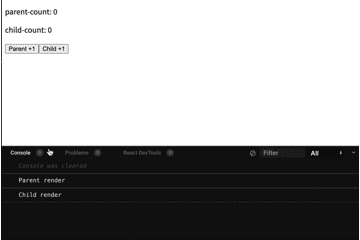
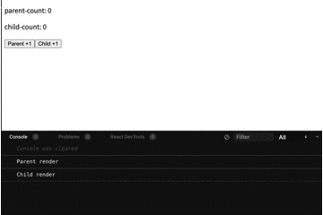
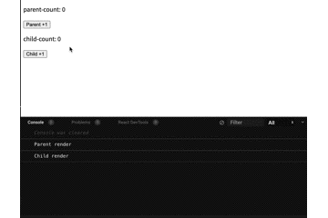

Reactに限らず、アプリ作成にはパフォーマンスを考える過程があります。  
「この処理は重いから描写が遅い」なり「なんども同じものを再描画している」など、ちょっとした挙動が後の足枷となりえます。

ここでは、Reactでのパフォーマンスの改善方法についてまとめてみます。

## 再レンダリングされる条件
まず、前提として覚えておきたいReactの挙動があります。再レンダリングの条件です。  
主に以下の点に該当した時、再レンダリングがなされます。

- stateが更新された時
- 親が再レンダリングされると無条件で子コンポーネントも再レンダリング

## コンポーネントのメモ化（React.memo）
まずはこの例からいきましょう。  
なにも対策をしなければ、親コンポーネントであるAppが更新されると、Childコンポーネントも再レンダリングされます。
```jsx
const Child = (props) => {
  console.log(`Child render`)
  return (
    <p>child-count: {props.childCount}</p>
  )
}

const App = () => {
  console.log('Parent render')
  const [count, setCount] = React.useState(0)
  const [childCount, setChildCount] = React.useState(0)

  return (
    <>
      <p>parent-count: {count}</p>
      <Child childCount={childCount} />
      <button type="button" onClick={() => setCount(count + 1)}>Parent +1</button>
      <button type="button" onClick={() => setChildCount(childCount + 1)}>Child +1</button>
    </>
  )
}
```


そこで、React.memoの登場です。
**コンポーネント（コンポーネントのレンダリング結果）をメモ化する React の API（メソッド）です。**  
Childコンポーネントをメモ化してみましょう。

```jsx
const Child = React.memo((props) => {
  console.log(`Child render`)
  return (
    <p>child-count: {props.childCount}</p>
  )
})

const App = () => {
  console.log('Parent render')
  const [count, setCount] = React.useState(0)
  const [childCount, setChildCount] = React.useState(0)

  return (
    <>
      <p>parent-count: {count}</p>
      <Child childCount={childCount} />
      <button type="button" onClick={() => setCount(count + 1)}>Parent +1</button>
      <button type="button" onClick={() => setChildCount(childCount + 1)}>Child +1</button>
    </>
  )
}
```


React.memoは**propsの値が同じ値かどうか**をみています。  
**等価性**といいますが、これで渡された値が異なる時にのみ再レンダリングが走るようになっています。  
これで、Childコンポーネントが不要に再レンダリングされなくなりました。

## コールバック関数のメモ化（React.useCallback）
**メモ化されたコールバック関数を返すフック**になります。  
基本構文は`useCallback(コールバック関数, 依存配列);`です。

以下のコードをみてください。
```jsx
const Child = React.memo((props) => {
  console.log(`Child render`)
  return (
    <>
      <p>child-count: {props.childCount}</p>
      <button onClick={props.handleClick}>Child +1</button>
    </>
  )
})

const App = () => {
  console.log('Parent render')
  const [count, setCount] = React.useState(0)
  const [childCount, setChildCount] = React.useState(0)

  const handleClick = () => setChildCount(childCount + 1)

  return (
    <>
      <p>parent-count: {count}</p>
      <button type="button" onClick={() => setCount(count + 1)}>Parent +1</button>
      <Child childCount={childCount} handleClick={handleClick} />
    </>
  )
}
```
この場合、Childは再レンダリングされるでしょうか？  
「メモ化されているからされないのでは」と感じるかもしれませんが、再レンダリングされるんです。


これは、handleClick関数がstateが変わるたびに再生成されるため、propsの等価性が保たれていないのが原因です。

ではどうすればよいか。ここでuseCallbackを使用します。
```jsx
const Child = React.memo((props) => {
  console.log(`Child render`)
  return (
    <>
      <p>child-count: {props.childCount}</p>
      <button onClick={props.handleClick}>Child +1</button>
    </>
  )
})

const App = () => {
  console.log('Parent render')
  const [count, setCount] = React.useState(0)
  const [childCount, setChildCount] = React.useState(0)

  // ここでhandleClick関数をメモ化する
  const handleClick = React.useCallback(() => setChildCount(childCount + 1), [childCount])

  return (
    <>
      <p>parent-count: {count}</p>
      <button type="button" onClick={() => setCount(count + 1)}>Parent +1</button>
      <Child childCount={childCount} handleClick={handleClick} />
    </>
  )
}
```


上記の状態は以下の通りです。
- useCallbackを使用することで、handleClick関数がメモ化されている 
- Childコンポーネントがメモ化されている
  
上記の条件が満たされているため、Childコンポーネントのpropsの等価性が保たれ、再レンダリングされなくなります。

### useCallbackを再生成抑制のためだけに使用してもいいのでは？
実際、再生成されないために単体でuseCallbackを使用しても問題ないです。

しかし、useCallbackを使用するにもコストがかかるので、メモ化する関数が本当に処理が重い時にのみ使用するなど考えないと返ってパフォーマンスを下げかねません。

## 値のメモ化（React.useMemo）
**メモ化された値を返すフック**です。  
基本構文は`useMemo(() => 値を計算するロジック, 依存配列);`です。

```jsx
const App = () => {
  const [count1, setCount1] = React.useState(0)
  const [count2, setCount2] = React.useState(0)
  
  const doubled = count => {
    let i = 0
    while (i < 1000000000) i++
    return count * 2
  }
  
  const doubledCount = React.useMemo(() => doubled(count2), [count2])
  
  // 同一コンポーネント内でコンポーネントを作成する時にはuseMemoを使用します
  // const doubledCountComponent = React.useMemo(() => {
  //   const doubleCount = double(count2)
  //   return (
  //     <p>
  //       Counter: {count2}, {doubledCount}
  //     </p>
  //   )
  // }, [count2])

  return (
    <>
      <section>
        <h2>Increment count1</h2>
        <p>Counter: {count1}</p>
        <button onClick={() => setCount1(count1 + 1)}>Increment count1</button>
      </section>
      <section>
        <h2>Increment count2</h2>
        <p>Counter: { count2 }, { doubledCount }</p>
        {/*{doubleCountComponent}*/}
        <button onClick={() => setCount2(count2 + 1)}>Increment count2</button>
      </section>
    </>
  )
}
```

上記の例だと、count2を二倍にして返す計算をしています`doubledCount`。  
計算結果をメモ化したことでcount1が更新されても再計算されずに済みます。

同一コンポーネント内でコンポーネントを作成する時にはuseMemoを使用します。React.memoではありません。

## 感想
ご利用は計画的に。無理のないパフォーマンスチューニングを心がけましょう。
