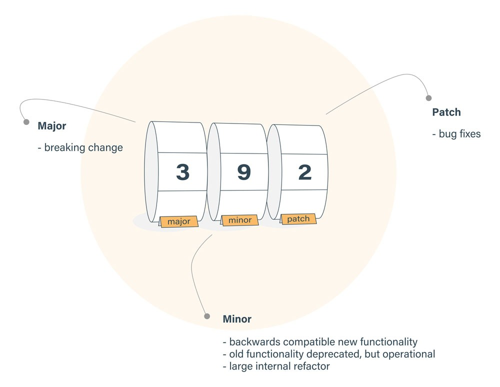

フロントエンドではパッケージのバージョンによって仕様が変わり、前まで動いてたのに...ってことが結構あります(そのためにlockファイルが存在しているのですが...)。

ところで、package.jsonに記述される`"xxx": ^o.o.o`
この読み方わかりますでしょうか。^は何を指しているのでしょうか。

今回は、スルーされそうなバージョン指定の読み方について紹介します。

## 概要図
この概要図が非常にわかりやすいと思います。

> https://bytearcher.com/goodies/semantic-versioning-cheatsheet/　より

主に3つの構造になっています。
- major
- minor
- patch

それぞれで変更された度合いが違います。それぞれみていきましょう。

### major
**破壊的変更**のときに更新されます。
破壊的、怖い文面ですが要するに、「以前と異なる結果を引き起こしうる変更」です。

身近で言うと、webpackがv4からv5に変化しましたね。変更点も大きく、いまだ改良がなされていますがissueが多くあり、安定しているとは言い難い状態です。

### minor
**既存の機能に影響を与えない程度の変更**です。バグの修正やセキュリティなどの対応が当たります。

### patch
**軽微なバグ**を直した際に更新されます。

## version指定記号
### version
指定versionと一緒のバージョンがインストールされます。
```json:title=package.json
{
  "dependencies": {
    "sample": "1.0.0"
  }
}
```
### >version
指定versionより大きいversionがインストールされます。
```json:title=package.json
{
  "dependencies": {
    "sample": ">1.0.0"
  }
}
```
その他、>=, <=, < など、その意味通りのversionがインストールされます。

### version - version
指定範囲を設定できます。
```json:title=package.json
{
  "dependencies": {
    "sample": "1.0.0 - 2.0.0"
  }
}
```
この例だと、`1.0.0 <= x.x.x <= 2.0.0` となります。

### *,x
ワイルドカードとして扱えます。
```json:title=package.json
"dependencies": {
    "name1": "*",  // あらゆるversion
    "name2": "1.x.x",    // >=1.0.0 and <2.0.0
    "name3": ""      // *と同じ
}
```

### ^version
caret(キャレット)といい、**一番左の0以外の数字のバージョンを更新しないような、更新**が可能となります。
```json:title=package.json
{
  "dependencies": {
    "name1": "^1.1.1",  // >=1.1.1 and <2.0.0
    "name2": "^0.1.1",    // >=0.1.1 and <0.2.0
    "name3": "^0.0.1"      // >=0.0.1 and <0.0.2
  }
}
```

### ~version
tilda(チルダ)といい、**minorバージョンが明記されている場合はpatchバージョン部分の更新ができ、そうでない場合はminorバージョンの更新**が可能となります。
```json:title=package.json
{
  "dependencies": {
    "name1": "~1.1.1",  // >=1.1.1 and <1.2.0
    "name2": "~1.1",    // >=1.1.0 and <1.2.0
    "name3": "~1"      // >=1.1.0 and <2.0.0
  }
}
```

## 感想
バージョンの違いによっては環境が作動しないことがあります。
このように読み方を知っていると、難なく乗り越えられる気がします。
