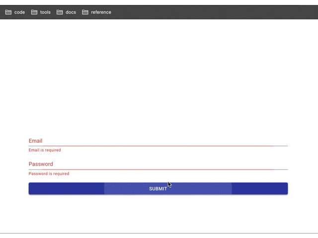

Reactでは、フォーム処理が面倒なときがあります。  
一つや二つの項目ならそこまで処理の必要はありませんが、増えるにつれ、やっかいなものになります。  
バリデーションも考えなくてはいけないので、より煩わしさが増すことが予測されます。

なるべく楽をして、端的に処理をしていきたいものです。

そこで、今回はReact専用のライブラリである、Formikについて紹介します。

<adsense></adsense>

## Formikでできること
1. フォームのvalue管理
2. エラーハンドリング管理ができる
3. バリデーションを設定できる
4. onChangeやonSubmitなどのイベントハンドラを提供
5. idかname属性を与えることで、要素の変更を検知できる

以上の5点が主な特徴です。

## サンプルを作る
### 仕様
簡単にメール、パスワードを入力し、バリデーションが通れば入力がアラートで表示されるようにしましょう。  
今回のサンプルは、Material-ui + TypeScriptで作成します。

使用しているライブラリ等のバージョンは以下の通り。
```shell
"@material-ui/core": "^4.11.3",
"@types/node": "^12.0.0",
"@types/react": "^17.0.0",
"@types/react-dom": "^17.0.0",
"react": "^17.0.1",
"react-dom": "^17.0.1",
"react-scripts": "4.0.2",
"typescript": "^4.1.2",
"web-vitals": "^1.0.1",
"yup": "^0.32.8"
```

yup、という見慣れないライブラリがでてきました。

これはformikと連携してバリデーションチェックをしてくれます。  
後述しますが、formikの`validationSchema`にyupのオブジェクトスキーマを登録した時、機能します。

### コード
```tsx:title=App.tsx
import React from 'react'
import {Formik} from 'formik'
import * as yup from 'yup'

import { makeStyles } from '@material-ui/core/styles'
import TextField from '@material-ui/core/TextField'
import Button from '@material-ui/core/Button'

const useStyles = makeStyles({
  wrapper: {
    minHeight: '100vh',
    alignItems: 'center',
    justifyContent: 'center',
    display: 'flex'
  },
  form: {
    maxWidth: '768px',
    width: '95%'
  },
})

interface ValueProps {
  email: string
  password: string
}

const validationSchema = yup.object({
  email: yup
    .string()
    .email('Enter a valid email')
    .required('Email is required'),
  password: yup
    .string()
    .min(8, 'Password should be of minimum 8 characters length')
    .required('Password is required'),
})

const initialValues: ValueProps = {
  email: '',
  password: '',
}

const App = () => {
  const classes = useStyles()

  return (
    <div className={classes.wrapper}>
      <Formik
        initialValues={initialValues}
        validationSchema={validationSchema}
        onSubmit={(values, actions) => {
          alert(JSON.stringify(values, null, 2))
          actions.setSubmitting(false)
          actions.resetForm()
        }}
      >
        {props => (
          <form className={classes.form} onSubmit={props.handleSubmit}>
            <TextField
              fullWidth
              id="email"
              name="email"
              label="Email"
              value={props.values.email}
              onChange={props.handleChange}
              error={props.touched.email && Boolean(props.errors.email)}
              helperText={props.touched.email && props.errors.email}
            />
            <TextField
              fullWidth
              id="password"
              name="password"
              label="Password"
              type="password"
              value={props.values.password}
              onChange={props.handleChange}
              error={props.touched.password && Boolean(props.errors.password)}
              helperText={props.touched.password && props.errors.password}
            />
            <div style={{ marginTop: '1rem' }}>
              <Button
                color="primary"
                variant="contained"
                fullWidth
                type="submit"
              >
                Submit
              </Button>
            </div>
          </form>
        )}
      </Formik>
    </div>
  )
}

export default App
```

Formikコンポーネントには以下をセットします。
- `validationSchema`: バリデーションするためのyupオブジェクト
- `initialValues`: 初期の値をセット
- `onSubmit`: 送信後の処理

またコンポーネント内にpropsを渡すことで、formikにあるvalueやイベントハンドラなどを使用できます。

<adsense></adsense>

### こんな挙動になります


## 参照
- [Formik](https://formik.org/docs/)
- [yup](https://github.com/jquense/yup)
