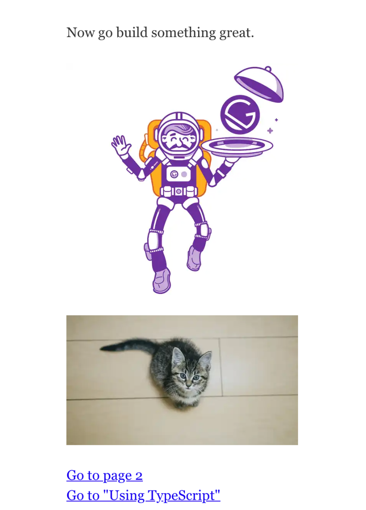

## 前提
Gatsbyにはgatsby-imageという画像最適化のためのプラグインがあります。  
GraphQLからファイルデータを取得し、gatsby-imageのImgコンポーネントにsrcとしてセットすることで、画像を最適化します。

ここでは、以下の要件が必要になってことを仮定して話を進めていきます。
- 1 ページに複数の画像がある
- 全て webp 対応した画像最適化をしたい  
- 再利用したい（いちいちImgコンポーネントを持ってこない）

## 再利用可能なコンポーネントを作成する

まずテンプレを持ってきます。

```shell
gatsby-starter-default@0.1.0 develop /Users/goqsystem_77/Desktop/my-gatsby-project

// インストール後
yarn start
```

さて、お出迎えするのは見慣れた宇宙服のおっさんですね。

`src/components/image.js`をみてみるとこんなコードが書いてあります。

```jsx:src/components/image.js
import React from "react"
import { useStaticQuery, graphql } from "gatsby"
import Img from "gatsby-image"

const Image = () => {
  const data = useStaticQuery(graphql`
    query {
      placeholderImage: file(relativePath: { eq: "gatsby-astronaut.png" }) {
        childImageSharp {
          fluid(maxWidth: 300) {
            ...GatsbyImageSharpFluid
          }
        }
      }
    }
  `)

  if (!data?.placeholderImage?.childImageSharp?.fluid) {
    return <div>Picture not found</div>
  }

  return 
}

export default Image
```

`gatsby-astronaut.png`を検索し、その画像を引っ張ってきているだけですね。  
ファイル名をしていますので、使いまわしができません。

## webp 対応
前例だと webp が出力ができてません。  
といっても Fragment 名を変えるのみです。

```jsx:title=src/components/image.js
...(省略)
query {
  placeholderImage: file(relativePath: { eq: "gatsby-astronaut.png" }) {
    childImageSharp {
      fluid(maxWidth: 300) {
        ...GatsbyImageSharpFluid_withWebp
      }
    }
  }
}
...
```

これで OK です。

### fragment

Gatsby には`Fragment`という機能がありまして、任意のフィールドをまとめることができるんですね。  
今回だと、`GatsbyImageSharpFluid_withWebp`は以下のように展開されます。

```graphql
fragment GatsbyImageSharpFluid_withWebp on ChildImageSharp {
  base64
  aspectRatio
  src
  srcSetWebp
  srcWebp
  srcSet
  sizes
}
```

このフラグメントですが、どこで定義されたのかというと、`gatsby-transformer-sharp `プラグインによって定義されています。  
これはプロジェクトにデフォルトでインストールされています。

以下はドキュメントです。  
[https://www.gatsbyjs.com/plugins/gatsby-image/#fragments](https://www.gatsbyjs.com/plugins/gatsby-image/#fragments)

<adsense></adsense>

## props で受け取る

webp 対応はできました。では再利用をしていきましょう。  
結論、以下のように書き換えます。

```js:title=src/components/image.js
const Image = ({ assetUrl, alt }) => {
  const { allImageSharp } = useStaticQuery(graphql`
    query {
      allImageSharp {
        nodes {
          fluid(maxWidth: 300) {
            originalName
            ...GatsbyImageSharpFluid_withWebp
          }
        }
      }
    }
  `)

  return  n.fluid.originalName === assetUrl).fluid} alt={alt} />
}
```

query に`originalName`を追加しました。これはファイル名を取得するフィールドです。  
props に assetUrl と alt を設定しました。使用側でデータを渡して、受け取ります。

あとは、find メソッドで originalName と assetUrl が一致するものをフィルタリングし、fluid にアクセスします。

```js
<Image assetUrl="....png" alt="..." />
```

実際に使用してみました。
```jsx:title=src/pages/index.js
<div style={{ maxWidth: `300px`, marginBottom: `1.45rem` }}>
  <Image assetUrl='gatsby-astronaut.png' alt='astronaut' />
</div>
<div style={{ maxWidth: `300px`, marginBottom: `1.45rem` }}>
  <Image assetUrl='neko.jpg' alt='neko' />
</div>
```



<adsense></adsense>
