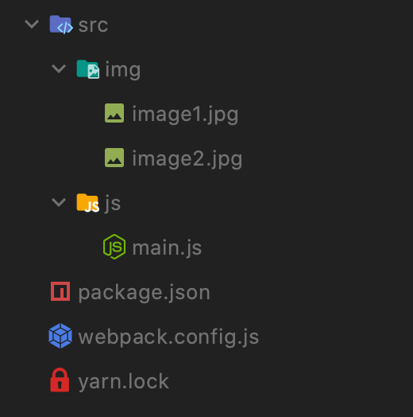
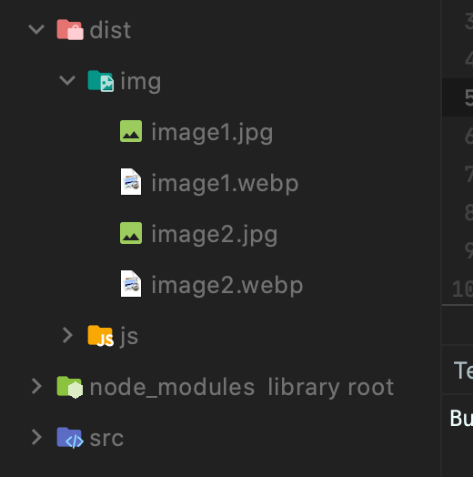
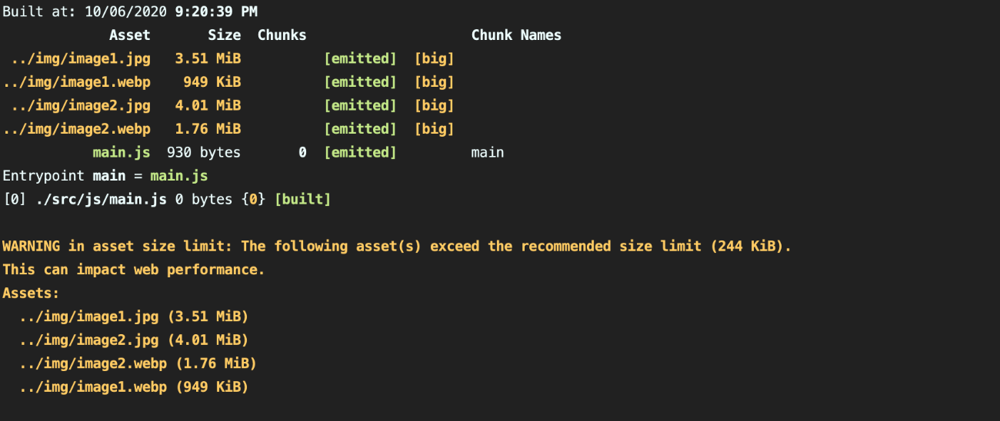

2010 年 9 月 30 日、Google が発表した WebP という静止画像フォーマット。  
みなさん、周知の事実であると思います。

Safari14 から WebP がサポートされ、ついにモダンブラウザのラインナップが揃いました。これから積極的に使用されていくと思われます。

しかし肝心な生成方法がまだ不足しています。  
PhotoShop でプラグインを入れるか、コマンドラインから直接生成するか...

そこで、フロント開発環境でお世話になっている webpack を使用した、生成方法について執筆していきます。

なお、以下の環境での動作確認です。

```
"copy-webpack-plugin": "^6.2.0",
"file-loader": "^6.1.0",
"imagemin-webp-webpack-plugin": "^3.3.3",
"path": "^0.12.7",
"webpack": "^4.44.2",
"webpack-cli": "^3.3.12"
```

## package.json

早速ですが、package.json の中身から確認します。

```json
{
  "name": "webp-with-webpack",
  "version": "1.0.0",
  "main": "index.js",
  "license": "MIT",
  "scripts": {
    "webpack": "NODE_ENV=production webpack",
    "webpack:watch": "NODE_ENV=development webpack -w"
  },
  "devDependencies": {
    "copy-webpack-plugin": "^6.2.0",
    "file-loader": "^6.1.0",
    "imagemin-webp-webpack-plugin": "^3.3.3",
    "path": "^0.12.7",
    "webpack": "^4.44.2",
    "webpack-cli": "^3.3.12"
  }
}
```

今回のメインは、imagemin-webp-webapck-plugin です。
こちらのプラグインを使用すると、指定した jpg や png ファイルを自動的に変換してくれる様になります。

## webpack.config.js

これがないと始まりませんね。webpack の設定ファイルになります。

```js
const path = require('path')
const ImageminWebpWebpackPlugin = require('imagemin-webp-webpack-plugin')
const CopyWebpackPlugin = require('copy-webpack-plugin')
const MODE =
  process.env.NODE_ENV === 'development' ? 'development' : 'production'

const config = {
  mode: MODE,
  entry: './src/js/main.js',
  output: {
    path: path.resolve(__dirname, 'dist/js'),
    filename: '[name].js',
  },
  module: {
    rules: [
      {
        test: /\.(jpe?g|png)$/i,
        loader: 'file-loader',
        options: {
          name: '[name].[ext]?[hash]',
          outputPath: path.resolve(__dirname, 'dist/img'),
        },
      },
    ],
  },
  plugins: [
    new CopyWebpackPlugin({
      patterns: [
        {
          from: 'src/img/',
          to: path.resolve(__dirname, 'dist/img'),
        },
      ],
    }),
    new ImageminWebpWebpackPlugin({
      config: [
        {
          test: /\.(jpe?g|png)$/i,
          options: {
            quality: 60,
          },
        },
      ],
      detailedLogs: true,
    }),
  ],
}

module.exports = config
```

webpack の詳細は省きます。  
注目していただきたいのは、plugins 配列の中にある`new ImageminWebpWebpackPlugin`です。
test プロパティで該当する拡張子を指定し、options の quality は仕上がりの画質程度を指定します。  
detailedLogs はビルドのログにどれくらい変わったのか、出力をしてくれます。デフォルトは false なので、ここでは true にしています。

## 実際に生成する

実際にやってみましょう。  
`src/img`ディレクトリ内に、容量の多い jpg を 2 枚配置しています。


package.json では webpack コマンドでビルドが始まる様に記述していますので、早速実行してみましょう。

```shell
yarn webpack
```

すると、dist 内に webp が生成されたのがわかります。


さらに、ログには以下が出力されました。


Assets の部分に jpg と webp の比較がなされています。
結果から以下のことがわかりました。

- image1.jpg 3.51MiB -> image1.webp 949KiB
- image2.jpg 4.01MiB -> image2.webp 1.76MiB

いかがでしょうか。この数値だけでも恐るべしですね。  
数値だけでなく、png に使用すれば透過性は保ったまま、サイズの軽量化が測れるところも魅力的です。

## 感想

WebP が主流になっていくことは避けされないと思われます。  
これを気に積極的に使用していくことにします。

## 今回の使用モジュール Document

[imagemin-webp-webpack-plugin](https://www.npmjs.com/package/imagemin-webp-webpack-plugin)
