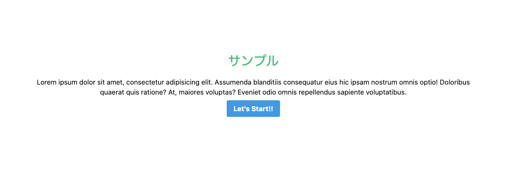

## 要約

Next.js で TailwindCSS を使用したプロジェクトを立ち上げるために、構築方法を書いていきます。

TailwindCSS はユーティリティに特化した CSS フレームワークです。  
詳しくは以下のリンクから確認してください。
[Tailwind CSS](https://tailwindcss.com/)

なお、今回使用するモジュールは以下の通りです。

```
"next": "9.5.3",
"react": "16.13.1",
"react-dom": "16.13.1",
"tailwindcss": "1.8.10"
```

## next.js プロジェクトを立ち上げる

```shell
$ npx create-next-app nextjs-with-tailwind

// プロジェクトまで移動しておきます
$ cd nextjs-with-tailwind
```

<adsense></adsense>

## Tailwind CSS を導入する
まずモジュールをインストールしましょう。

```shell
$ npm install tailwindcss --save-dev
```

次に設定ファイルを作成します。

```shell
$ npx tailwindcss init
```

すると同階層に tailwind.config.js が作成されたと思います。

```js:title=tailwind.config.js
module.exports = {
  purge: [],
  theme: {
    extend: {},
  },
  variants: {},
  plugins: [],
}
```

詳しくは説明しませんが、ここでは purge の部分を書き加えていきます。  
purge とは、対象のファイルの使用クラス以外の未使用クラスを排除してくれる機能です。

ここでは以下の様に設定します。

```js:title=tailwind.config.js
module.exports = {
  purge: ['./components/**/*.jsx', './pages/**/*.jsx'],
  theme: {
    extend: {},
  },
  variants: {},
  plugins: [],
}
```

こうすることで、components と pages ディレクトリ配下、.jsx ファイルをみて、未使用クラスを削除してくれます。  
**※purge しないとファイルサイズが膨大になりますので、ここは設定することを推奨します。**

<adsense></adsense>

最後に、コンパイルするための postcss.config.js を作成します。  
まずは必要モジュールをインストールします。

```shell
$ npm install postcss-preset-env --save-dev
```

次にファイルを作成します。

```js:title=postcss.config.js
module.exports = {
  plugins: [
    'tailwindcss',
    'postcss-preset-env'
  ]
}
```

これで、Tailwind CSS 導入は終わりです。

## Tailwind CSS を使用する

styles の中に global.css がありますので、そちらに読み込んでいきましょう。  
global.css は pages/\_app.js で読み込まれています。

試しに.btn-blue クラスを作成してみます。

```css:title=global.css
@tailwind base;
@tailwind components;
.btn-blue {
  @apply bg-blue-500 text-white font-bold py-2 px-4 rounded;
}
@tailwind utilities;
```

そして、pages/index.jsx を以下の様に書き換えてみます。

```jsx:title=pages/index.jsx
import Head from 'next/head'

const Home = () => {
  return (
      <section className="h-screen w-4/5 max-w-5xl mx-auto flex items-center justify-center flex-col">
        <h1 className="mb-4 text-green-500 text-3xl">サンプル</h1>
        <p className="mb-2 text-center">Lorem ipsum dolor sit amet, consectetur adipisicing elit. Assumenda blanditiis consequatur eius hic ipsam nostrum omnis optio! Doloribus quaerat quis ratione? At, maiores voluptas? Eveniet odio omnis repellendus sapiente voluptatibus.</p>
        <button className="btn-blue">Let's Start!!</button>
      </section>
  )
}

export default Home
```

一方、UI はどうなったのかというと...

しっかり反映されています。

## 楽するために

個人的に css 命名で苦しむことが多くありました。  
そのことから、Tailwind CSS を使用して、より開発に集中できる環境を作りたいと思い、この記事を執筆した次第です。

Tailwind CSS はユーティリティークラスを基調としたカスタマイズ性に富んでいることも大きな魅力です。  
@apply だけでなく、@screen や theme 関数など便利な機能もあります。

私自身も、積極的に取り入れて開発を進めていきたいですね。

## P.S
Tailwind CSS 公式もいいですが、一目でクラス名を確認できるチートシートが存在します。  
[Tailwind CSS チートシート](https://nerdcave.com/tailwind-cheat-sheet)
