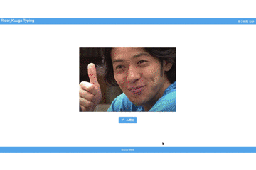

突然ですが、私は仮面ライダーが好きです。  
その中でも**クウガ**は特別な存在です。

あの臨場感、人間味溢れるストーリー、CG技術じゃ表せないリアル感、主人公の戦い方。

平成ライダーの先駆けとなった変身！を知らしめた作品でもあります。

クウガにも様々なフォームがあります。楽しく覚えたいですよね。  
なのでタイピングしながらやれば楽しく、無意識に覚えるのではないかと考えました。

ということで作成した次第です。

## こんなものです
タイマーを右上に設置しています。  
あとはスタートするとランダムにフォームデータが表示され、タイピングします。

終わった後はタイプ数とミスタイプ数が表示される、という簡易的なものです。


## 使用環境
TypeScriptのみです。コンパイルにWebpackを使用しています。  
UIはtailwindcssのcdnを読み込んで使用しています。

以下、GitHubソースコードです。  
https://github.com/k-logic24/typing_game_riders

## コード
```html:title=index.html
<!doctype html>
<html lang="ja">
<head>
	<meta charset="UTF-8">
	<meta name="viewport"
	      content="width=device-width, user-scalable=no, initial-scale=1.0, maximum-scale=1.0, minimum-scale=1.0">
	<meta http-equiv="X-UA-Compatible" content="ie=edge">
	<title>仮面ライダークウガ-タイピング</title>
	<link href="https://unpkg.com/tailwindcss@^1.0/dist/tailwind.min.css" rel="stylesheet">
</head>
<body class="h-screen">
	<div class="flex flex-col justify-between h-full">
		<header class="py-2 px-4 bg-blue-400">
			<div class="text-white flex justify-between items-end">
				<h1 class="text-2xl">Rider_Kuuga Typing</h1>
				<p>残り時間 <span id="timer"></span>秒</p>
			</div>
		</header>
		<main class="py-20">
			<div class="mx-auto container">
				<div class="text-center intro">
					<figure class="mb-8">
						
					</figure>
					<button id="start-btn" class="bg-blue-400 text-white rounded font-bold px-4 py-2">ゲーム開始</button>
				</div>
				<div class="start hidden">
					<figure>
						
					</figure>
					<div class="mt-16 text-center">
						<span id="riderNameJp"></span>
						<p id="riderNameEn" class="mb-4 text-4xl"></p>
					</div>
				</div>
				<div class="finished hidden">
					<div class="text-center">
						<p>
							タイピング数: <span id="score"></span>
						</p>
						<p>
							ミスタイプ: <span id="miss"></span>
						</p>
						<button id="reset-btn" class="bg-blue-400 text-white rounded font-bold px-4 py-2 mt-4">もう一回</button>
					</div>
				</div>
			</div>
		</main>
		<footer class="py-2 px-4 text-center bg-blue-400">
			<small class="text-white">&copy;2020 iwata</small>
		</footer>
	</div>
	<script type="module" src="dist/main.js"></script>
</body>
</html>
```
```typescript:title=constants.ts
export const riders = [
  {
    'name': {
      'en': 'mightyform',
      'ja': 'マイティフォーム'
    },
    'src': 'images/mighty.jpg'
  },
  {
    'name': {
      'en': 'dragonform',
      'ja': 'ドラゴンフォーム'
    },
    'src': 'images/dragon.jpg'
  },
  {
    'name': {
      'en': 'pegasusform',
      'ja': 'ペガサスフォーム'
    },
    'src': 'images/pegasus.jpg'
  },
  {
    'name': {
      'en': 'titanform',
      'ja': 'タイタンフォーム'
    },
    'src': 'images/titan.jpg'
  },
  {
    'name': {
      'en': 'amazingmighty',
      'ja': 'アメイジングマイティ'
    },
    'src': 'images/amazingmighty.jpg'
  },
  {
    'name': {
      'en': 'ultimateform',
      'ja': 'アルティメットフォーム'
    },
    'src': 'images/ultimate.jpg'
  },
  {
    'name': {
      'en': 'gourum',
      'ja': 'ゴウラム'
    },
    'src': 'images/gourum.jpg'
  }
]
```
```typescript:title=main.ts
import { riders } from  './constants'
type RiderProps = typeof riders
type RiderNameProps = {
  ja: string
  en: string
}
const intro = document.querySelector('.intro')
const start = document.querySelector('.start')
const finished = document.querySelector('.finished')
const score = document.getElementById('score')
const miss = document.getElementById('miss')
const timer = document.getElementById('timer')
const startBtn = document.getElementById('start-btn')
const resetBtn = document.getElementById('reset-btn')
const nameEn = document.getElementById('riderNameEn')
const nameJp = document.getElementById('riderNameJp')
const imageArea = document.getElementById('riderImg') as HTMLImageElement
class GameState {
  private readonly riders: RiderProps
  selectedRiderName: RiderNameProps
  selectedRiderImg: string
  score: number = 0
  miss: number = 0
  limitTimer: number = 10

  protected constructor(riders) {
    this.riders = riders
  }

  get getRiders() {
    return this.riders
  }

  protected printData() {
    nameEn.innerText = this.selectedRiderName.en
    nameJp.innerText = this.selectedRiderName.ja
    imageArea.src = this.selectedRiderImg
  }

  protected printTimer() {
    timer.innerText = String(this.limitTimer)
  }

  protected printScore() {
    score.innerText = String(this.score)
    miss.innerText = String(this.miss)
  }
}

class GameAction extends GameState {
  private static instance: GameAction
  static getInstance() {
    if (!GameAction.instance) {
      GameAction.instance = new GameAction(riders)
    }
    return GameAction.instance
  }
  static switchPhase(phase) {
    switch (phase) {
      case 'start':
        intro.classList.add('hidden')
        start.classList.remove('hidden')
        break
      case 'finished':
        start.classList.add('hidden')
        finished.classList.remove('hidden')
        break
      case 'restart':
        finished.classList.add('hidden')
        intro.classList.remove('hidden')
    }
  }
  init() {
    const copyRider = JSON.parse(JSON.stringify(this.getRiders))
    const rnd = Math.floor(Math.random() * copyRider.length)
    const selectRider = copyRider[rnd]
    this.selectedRiderName = selectRider.name
    this.selectedRiderImg = selectRider.src
    this.printData()
    this.printTimer()
  }
  start() {
    const countDown = setInterval(() => {
      this.limitTimer--
      this.printTimer()
      if (!this.limitTimer) {
        this.printScore()
        GameAction.switchPhase('finished')
        clearInterval(countDown)
        return
      }
    }, 1000)
  }
  typing(key: string) {
    const splitRiderName = this.selectedRiderName.en.split('')

    if (key === splitRiderName[0]) {
      this.score++
      this.selectedRiderName.en = splitRiderName.slice(1).join('')
      nameEn.innerText = this.selectedRiderName.en
      if (!this.selectedRiderName.en) {
        this.init()
      }
      return
    }
    this.miss++
  }
  reset() {
    this.score = 0
    this.miss = 0
    this.limitTimer = 60
    this.init()
  }
}
const gameAction = GameAction.getInstance()
gameAction.init()

startBtn.addEventListener('click', () => {
  gameAction.start()
  GameAction.switchPhase('start')
})
document.addEventListener('keypress',  function(event) {
  gameAction.typing(event.key)
})
resetBtn.addEventListener('click', () => {
  gameAction.reset()
  GameAction.switchPhase('restart')
})
```

クラスベースに作成しています。  
GameActionでスタート、タイピング、フィニッシュのアクション処理を集約し、GameState値を変更します。GameStateはstateを保持し、変化した値をdom上に描写するのみです。

GameActionをインスタンス化するとき、単一のインスタンスを使用するようシングルトンパターンを適応させています。staticメソッドの`getInstance`の部分です。

## 感想
最初はJSでやっていたのですが、「private protected修飾子なくね？というか型がないのが気持ち悪いな。」となり、途中からTSを導入しました。

好きなもののゲームを作成するとなったら、出来はどうであれ楽しいものです。
